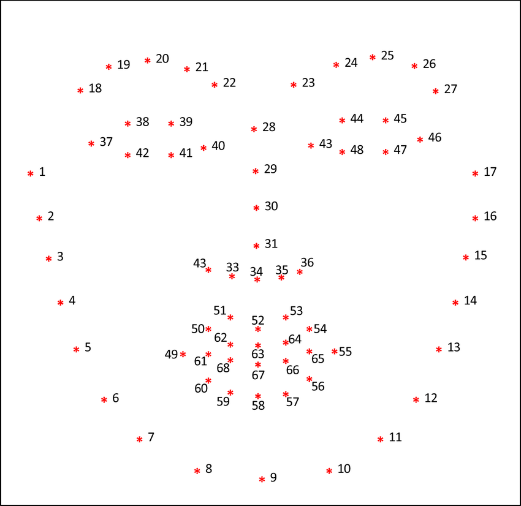

# Facial Landmarks With dlib

You nedd to download [shape_predictor_68_face_landmarks](https://github.com/tzutalin/dlib-android/blob/master/data/shape_predictor_68_face_landmarks.dat)

For more information [Facial landmarks with dlib, OpenCV, and Python](https://pyimagesearch.com/2017/04/03/facial-landmarks-dlib-opencv-python/)
